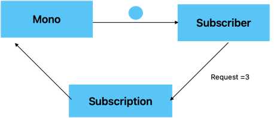
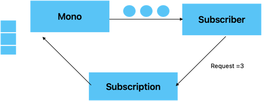

# Reactive Programming

Reactive programming is a programming paradigm that focuses on asynchronous and event-driven programming. It provides a way to handle and compose streams of data or events, allowing developers to build systems that are more responsive, scalable, and resilient.

In Java, reactive programming is commonly implemented using libraries such as Reactor and RxJava. These libraries provide abstractions and operators to work with reactive streams and manage the flow of data or events. The core concepts in reactive programming are as follows:

1. Streams: Reactive programming deals with streams of data or events that can be observed and reacted to. Streams can emit values over time, and developers can subscribe to these streams to process the emitted values.

2. Observables (Publishers): Observables represent a stream of data or events that can be observed. They emit values to their subscribers, and multiple subscribers can subscribe to the same observable. In Java, the Flux class in Reactor and the Observable class in RxJava are examples of observables.

3. Observers (Subscribers): Observers are entities that subscribe to observables to receive and process the emitted values. They define the behavior that is executed when new values are emitted, including transformations, filtering, and side effects.

4. Operators: Operators are functions or methods that allow developers to transform, combine, or filter streams of data. They can be used to perform operations such as mapping, filtering, reducing, or merging streams. Libraries like Reactor and RxJava provide a wide range of operators to manipulate reactive streams.

Reactive programming promotes a declarative and functional style of programming, where developers describe the desired behavior using streams and operators, rather than explicitly managing low-level concurrency or callbacks. It enables the development of highly scalable and responsive systems by leveraging the asynchronous and non-blocking nature of reactive streams.

It's worth noting that reactive programming is a broad topic, and there are other aspects and concepts beyond what has been covered here.

### **Subscribe**
1. onNext - Consumer<T>
2. onError - Consumer<Throwable>
3. onComplete - Runnable

### **Faker**
It is used to create dummy data.

**Example**: Faker.instance().name().fullName())

## **Reactor**

Reactor is a popular reactive programming library for Java.It provides a programming model for building reactive, scalable, and resilient applications. 
It is mechanism of asynchronous and event-driven programming, allowing developers to compose streams of data or events and process them in a non-blocking manner.

It has 2-different implementations
1. [x] **Mono`<T>`** 

It representing a stream of zero or one element. It is similar to Flux, but it guarantees to emit at most one element or an empty completion signal.

| Type                  | Condition                                                  | What to Use                                                             |
|-----------------------|------------------------------------------------------------|-------------------------------------------------------------------------|
| Create Mono           | Data already present                                       | Mono.just(data)                                                         |
| Create Mono           | Data to be calculated                                      | Mono.fromSupplier(()-> getData()) Mono.fromCallable(()-> getData()) |
| Create Mono           | Data is coming from AsyncCompletable future                | Mono.fromFuture(future)                                                 |
| Create Mono           | Emit empty once a given runnable is complete               | Mono.fromRunnable(runnable)                                             |
| Pass Mono as Argument | Function accepts a Mono`<Address>`. But I do not have data | Mono.empty()                                                            |
| Return Mono           | Function needs to return Mono                              | Mono.error(...) Mono.empty() above creation type                |

2. [x] **Flux`<T>`**

It emits 0 or N items

It is a publisher of data and supports backpressure, which means it can handle the flow control between publishers and subscribers. Flux provides various methods for creating, transforming, and consuming streams of data in a reactive manner. It emits elements to its subscribers and can be consumed asynchronously.

**FluxSink:** 

FluxSink is an interface that provides a way to emit elements manually into a Flux. It is obtained from the Flux.create() method, which allows you to create a Flux with a custom emitter. FluxSink provides methods such as next(), error(), and complete() to emit elements, errors, or completion signals to the associated Flux. It gives you fine-grained control over the emission of elements and allows you to handle errors and completion manually.

